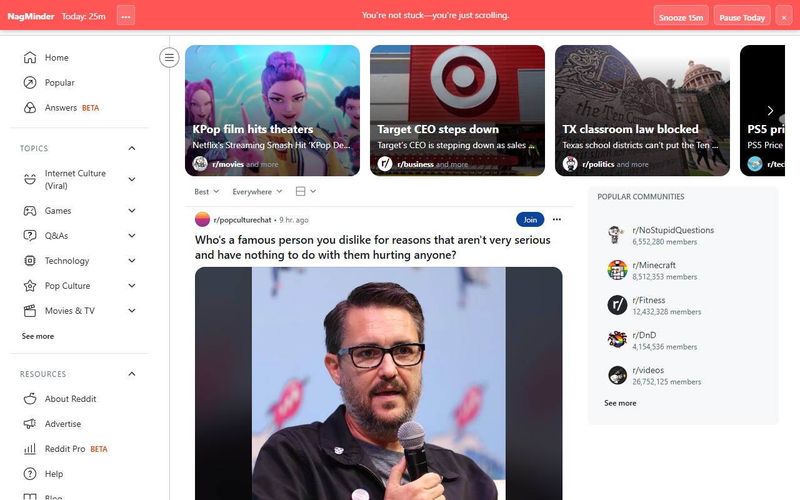
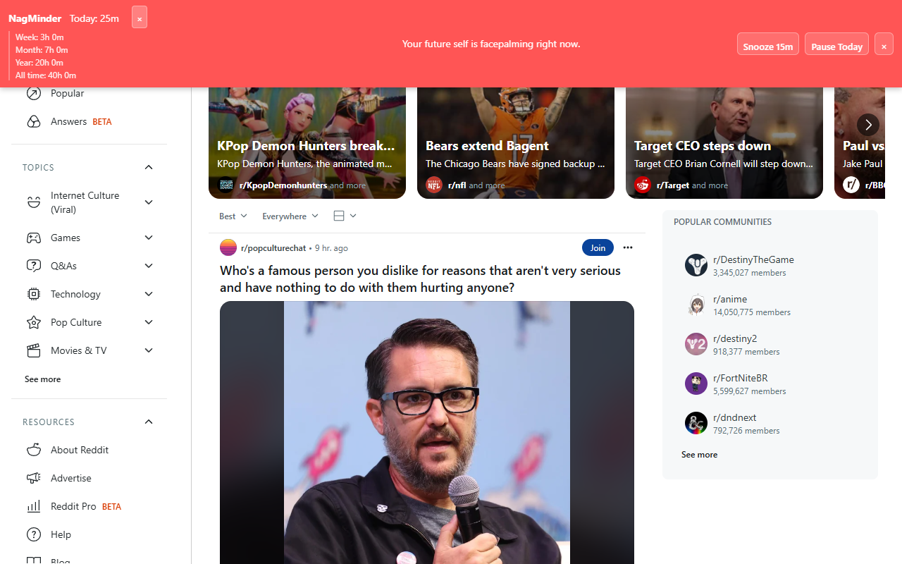

# NagMinder (Chrome Extension)

[](https://github.com/shotah/NagMinder/actions/workflows/ci.yml)
[](https://github.com/shotah/NagMinder/actions/workflows/release.yml)

A playful on-page **nag bar** that tracks how long you've been on social sites and nudges you with cheeky reminders.

**What you get**

- Time on current site **Today / This Week / This Month / This Year / All Time**
- A persistent **bar at the top** of social pages
- **Funny nag lines** that rotate while you browse
- **Snooze 15m** and **Pause Today** buttons
- Configurable domains, tick interval, and snooze time via **Options**

## 📸 NagMinder in Action

### Basic Time Tracking


_NagMinder showing time spent on Reddit with a playful nudge message_

### Detailed Stats (Click •••)


_Expandable view showing week, month, year, and all-time usage statistics_

---

## Quick Start (Load Unpacked)

1. Download the ZIP from your ChatGPT session and unzip it (or clone this repo).
2. Open Chrome → `chrome://extensions/`
3. Toggle **Developer mode** (top right).
4. Click **Load unpacked** → select the `NagMinder/` folder.
5. Visit a tracked site (e.g., `reddit.com`, `x.com`, `instagram.com`) — the Nag bar shows at the top.

> Data: settings sync via `chrome.storage.sync`. Usage time is stored locally via `chrome.storage.local` and never leaves your machine.

---

## How It Works

- A background **service worker** ticks every `tickSeconds` (default 5s).
- If your **active tab** is a tracked domain and you’re **not idle** (using the `chrome.idle` API, 60s threshold), the extension increments counters for:
  - **day** (resets at midnight local time)
  - **week** (ISO week number, resets on week change)
  - **month** (resets when month changes)
- The **content script** injects a minimal bar at the top and refreshes stats every ~5s.
- Snooze sets a timestamp (no bar until the snooze ends). **Pause Today** hides the bar for the rest of the day.

**Per‑site counters:** When you’re on `reddit.com`, you see only your `reddit.com` time for today/week/month.

---

## Options

Open `chrome://extensions`, find **NagMinder**, click **Details** → **Extension options**.  
You can change:

- ✅ Enable/disable
- 🌐 Domain list (one per line; subdomains are matched automatically)
- ⏱️ Tick interval (seconds; lower = more precise)
- 😴 Default snooze minutes

You can also **Reset Counters** from the options page (clears local totals and date markers).

---

## Files

```
NagMinder/
├── manifest.json         # MV3 manifest
├── background.js         # tracking, storage, messages, date resets
├── content.js            # in-page bar, render, snooze/pause
├── messages.js           # default funny lines
├── styles.css            # bar styles
├── options.html          # options UI
├── options.js            # options logic
└── icons/                # simple generated icons
```

---

## Customization

- **Messages**: edit `messages.js` to add/remove lines.
- **Default domains**: edit `DEFAULT_SETTINGS.domains` in `background.js` (or use Options).
- **Bar design**: tweak `styles.css`. It’s intentionally small & readable.
- **Granularity**: change `tickSeconds` in Options to `1` for near real‑time (slightly more CPU).

---

## Privacy

- No analytics. No network requests.
- All usage data stays in **`chrome.storage.local`** on your device.

---

## Troubleshooting

- **Bar doesn’t appear**: Make sure the site’s root domain is in Options. For example, add `x.com` (Twitter) instead of `twitter.com` if you use the new domain.
- **Still no bar?** Try disabling other extensions that alter page top bars or heavy content blockers that might block `content.js` injection.
- **Service worker asleep**: If the bar shows `--`, give it a few seconds; messaging wakes the worker.

---

---

## Development & Publishing

### Development Setup

```bash
# Install development dependencies
npm install

# Build for development
npm run dev

# Run validation and tests
npm run test

# Create production package
npm run package
```

### Chrome Web Store Publishing

#### Quick Method (Cross-Platform)

```bash
# Works on Windows, macOS, Linux
npm run package
```

#### Manual Steps

1. **Prepare for submission:**

   ```bash
   npm run package
   ```

2. **Go to Chrome Developer Console:**
   - Visit: https://chrome.google.com/webstore/devconsole/
   - Sign in with your Google account
   - Pay the $5 one-time developer registration fee (if first time)

3. **Upload your extension:**
   - Click "Add new item"
   - Upload the ZIP file from `dist/NagMinder-v1.0.0.zip`

4. **Fill out store listing:**
   - **Title**: NagMinder
   - **Summary**: A playful nag bar that tracks social media time and nudges you to be more productive
   - **Category**: Productivity
   - **Language**: English
5. **Add required assets:**
   - **Icon**: Upload your 128x128 icon
   - **Screenshots**: Take 1-5 screenshots showing the extension in action
   - **Promotional image** (optional but recommended): 440x280 or 920x680

6. **Privacy & Permissions:**
   - Explain why you need `storage`, `tabs`, and `idle` permissions
   - Add privacy policy if collecting any data (not needed for this extension)

7. **Submit for review:**
   - Review can take 1-7 days
   - Address any feedback from Google's review team

#### Store Listing Template

**Description:**

```
Track your social media time with a gentle, humorous nag bar. NagMinder shows how long you've spent on distracting sites today, this week, and this month - with funny reminders to help you stay focused.

✨ Features:
• Time tracking for social media sites (Facebook, Twitter/X, Instagram, Reddit, TikTok, YouTube, etc.)
• Today, week, and month counters
• Funny, motivational nag messages
• Snooze for 15 minutes when you need a break
• Pause tracking for today option
• Configurable domains and settings
• Privacy-focused: all data stays on your device

Perfect for anyone trying to reduce mindless scrolling and be more intentional with their time online.
```

**Keywords:** productivity, time tracking, social media, focus, distraction blocker, mindfulness

---

## License

MIT
